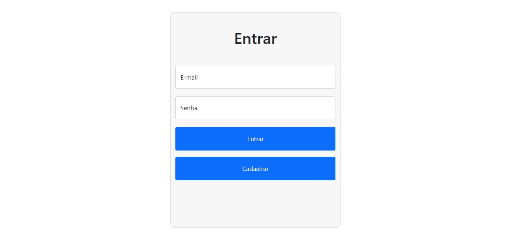
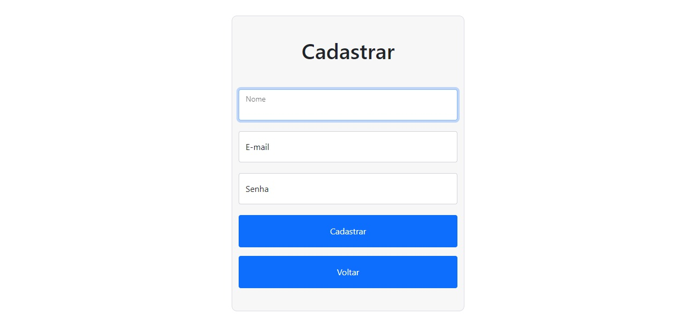
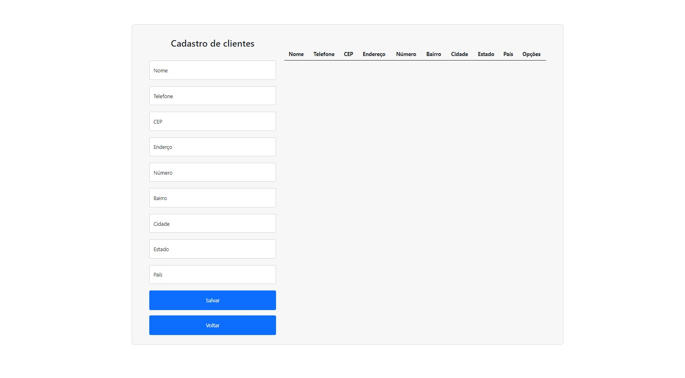

# CRUD JS
login, cadastro e crud utilizando html, css, bootstrap e javascript puro 💜

## 🚀 Como iniciar

1. git clone https://github.com/andressarfn/crud-js
2. cd vendor 
3. Abra o index.html

## 📦 Desenvolvimento

* O projeto foi desenvolvido sem um backend, utilizando o localStorage para salvar o objeto cadastrado, portanto será permitido apenas um cadastro por vez
* CEP e telefone possuem suas respectivas máscaras 
* Foi utilizada a [API](https://viacep.com.br/) para autocomplete do endereço através do CEP fornecido pelo usuário

## 📌 Imagens

  
  
  
  
## ✒️ Autores

* **Andressa Ribeiro** - [desenvolvedora](https://github.com/andressarfn)

## 🎁 Expressões de gratidão

* Conte a outras pessoas sobre esta iniciativa e projeto 📢
* Me convide para tomar uma cerveja 🍺 
* Compartilhe, se de alguma forma te ajudar 🤓
* etc.

---
⌨️ com ❤️ por [Andressa Ribeiro](https://github.com/andressarfn) 😊
